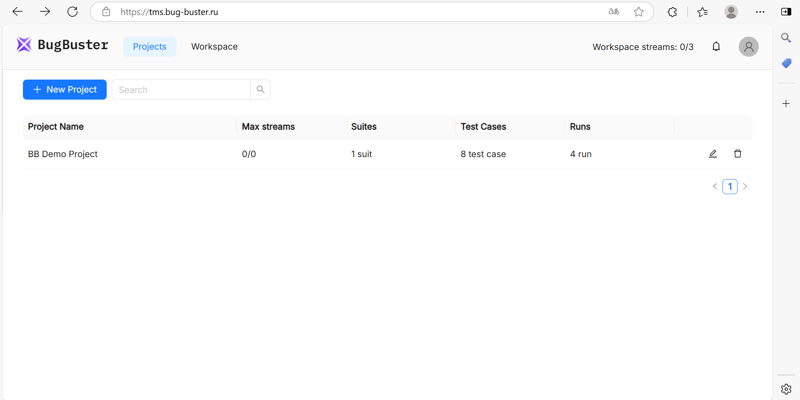
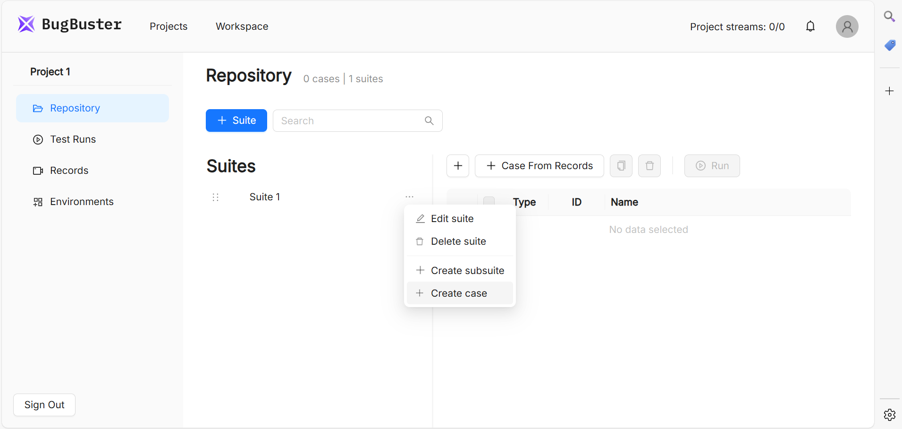

## **Регистрация и вход**

1. Платформа доступна по адресу [https://tms.bug-buster.ru/](https://tms.bug-buster.ru/) (регистрация бесплатна, есть пробный период).

2. После входа вы увидите список проектов. Всем новым пользователям доступен демонстрационный проект **BB Demo Project**, который содержит примеры тестовых команд и проверок. Он поможет быстро ознакомиться с функционалом платформы.

{width=1920px height=960px}

## **Создание первого тест-кейса**

1. Нажмите **\+ New Project**.

2. Внутри проекта создайте **Suite** (папку для группировки кейсов).

3. Добавьте новый тест-кейс через пункт **Create case** в выпадающем меню.

{width=1911px height=908px}