## Назначение

Шаг **API request** позволяет выполнять HTTP-запросы прямо внутри тест-кейса.

Это удобно для:

-  подготовки данных перед UI-тестом (например, авторизация, создание сущности);

-  проверки ответов от внешних API;

-  передачи данных между шагами через переменные.

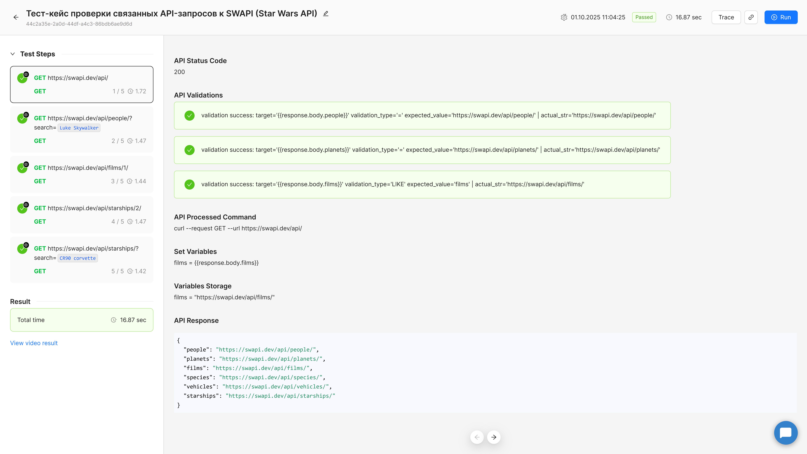{width=1920px height=1080px}

## Добавление шага API request

### Способ 1. Через кнопку добавления шага

1. Откройте форму **редактирования тест-кейса**.

2. Нажмите **“+ Add step”** и выберите **API request**.

3. Шаг появится в списке шагов с иконкой шестеренки (по аналогии с Expected Result).

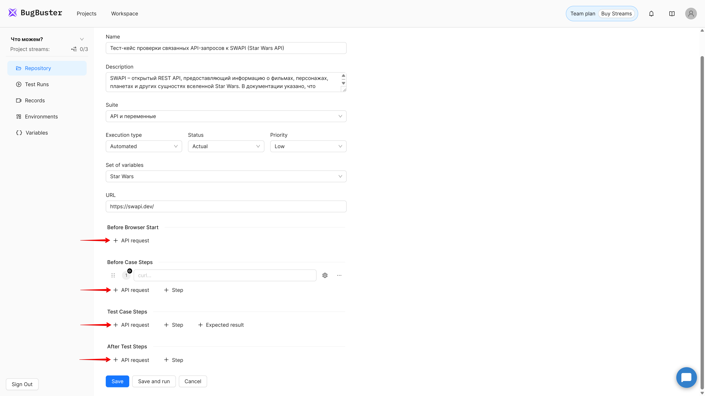{width=1920px height=1080px}

### Через контекстное меню

1. Нажмите на «…» на любом шаге.

2. В контекстном меню выберите **«+ API Request»** -- шаг появится под шагом от которого вызывалось меню.

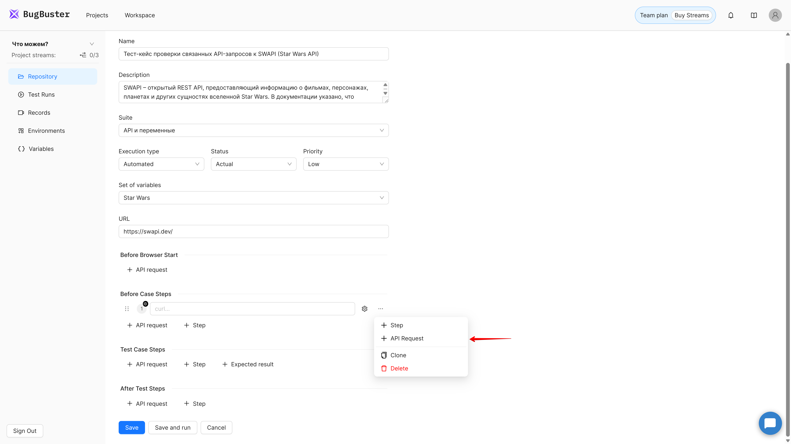{width=1920px height=1080px}

## Расширенная форма редактирования запроса

Для удобства работы используется **расширенная форма редактирования API-запроса** -- она открывается в модальном окне и позволяет задать все параметры запроса в привычном “Postman-подобном” интерфейсе.

Чтобы открыть её нажмите на иконку шестеренки рядом с шагом API request.

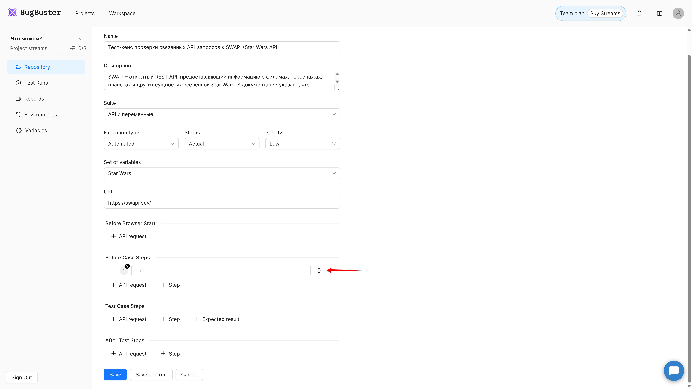{width=1920px height=1080px}

## Структура формы

| Раздел          | Назначение                   |
|-----------------|------------------------------|
| **Шапка формы** | Метод и URL запроса          |
| **Params**      | Query-параметры URL          |
| **Headers**     | Заголовки запроса            |
| **Body**        | Тело запроса                 |
| **Variables**   | Сохранение данных из ответа  |
| **Validation**  | Проверка корректности ответа |

В правом нижнем углу расположены кнопки **Save** и **Cancel**.

Форма закрывается только этими кнопками.

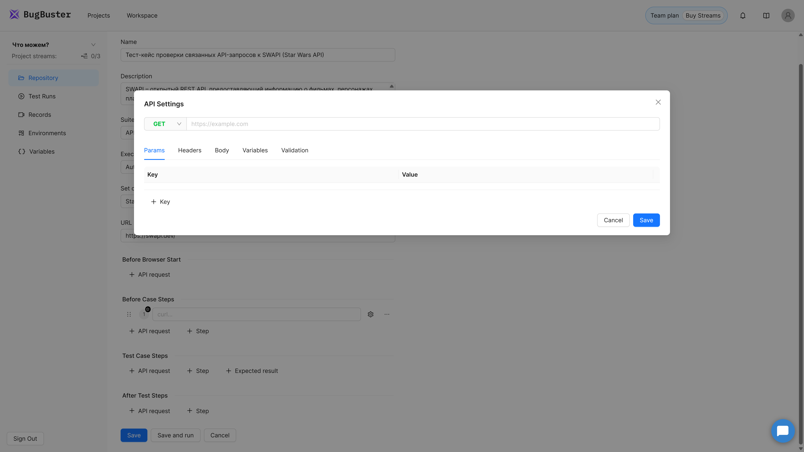{width=1920px height=1080px}

## Шапка формы

В верхней части окна расположены поля:

-  **HTTP-метод** -- выпадающий список: GET, POST, PUT, DELETE, PATCH, HEAD, OPTIONS.

-  **URL запроса** -- строка ввода адреса.

   -  Обязательное наличие протокола `https://` или `http://`.

   -  При ошибке форматирования URL подсвечивается красным.

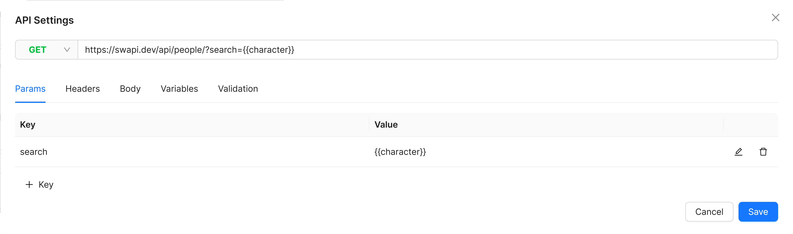{width=5121px height=1513px}

## Вкладка «Params»

Позволяет добавлять и редактировать Query-параметры (часть URL после `?`).

### Возможности

-  Добавление, редактирование и удаление строк с параметрами.

-  Изменения в таблице «Params» синхронизируются со значением в поле URL.

-  Поддерживается использование переменных (например, `{{user_id}}`).

Пример:

```
GET https://api.bugbuster.ai/orders?user={{user_id}}&status=active
```

## Вкладка «Headers»

Используется для указания HTTP-заголовков.

| Поле            | Пример значения    |
|-----------------|--------------------|
| `Content-Type`  | `application/json` |
| `Authorization` | `Bearer {{token}}` |

Поддерживаются переменные, редактирование и удаление строк.

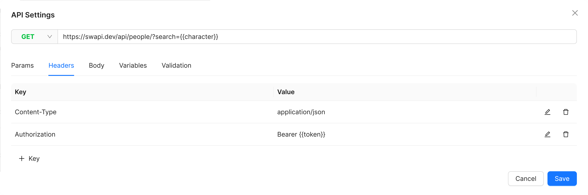{width=5122px height=1709px}

## Вкладка «Body»

Для методов POST, PUT, PATCH можно задать тело запроса.

### Формат ввода

-  многострочное текстовое поле;

-  можно использовать JSON, XML, form-data и другие форматы;

-  поддерживается подстановка переменных (`{{variable}}`).

Пример:

```
{
  "email": "{{user_email}}",
  "password": "{{user_password}}"
}
```

:::quote 

💡 В текущей версии поле ввода не поддерживает форматирование, но в будущем появятся визуальные редакторы.

:::

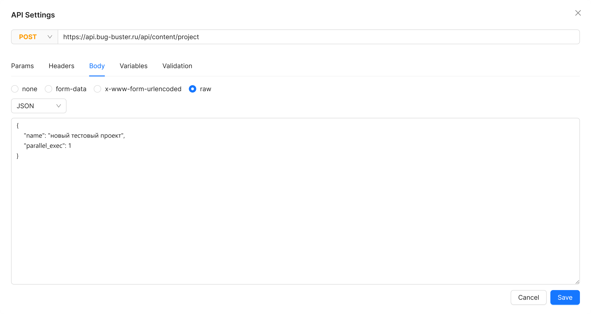{width=5120px height=2728px}

## Вкладка «Variables»

Позволяет сохранять данные из ответа запроса в переменные для дальнейшего использования в тест-кейсе (например, подставить токен, ID пользователя или статус заказа).

| Поле              | Описание                                                                                                            |
|-------------------|---------------------------------------------------------------------------------------------------------------------|
| **Variable Name** | Название переменной, можно указать переменную из справочника, тогда она переопределится на время запуска тест-кейса |
| **Response Path** | JSON-путь до нужного значения в ответе                                                                              |

Пример:

| Variable Name | Response Path                |
|---------------|------------------------------|
| `token`       | `{{response.body.token}}`    |
| `order_id`    | `{{response.body.order.id}}` |

Подробнее о том как работать с объектом `response` см. инструкцию [Работа с response](../rabota-s-json-putyami-i-obektom-response)

Подробнее о создании и редактировании переменных см. инструкцию [Переменные](../../../04-peremennye-i-okruzheniya/peremennye)

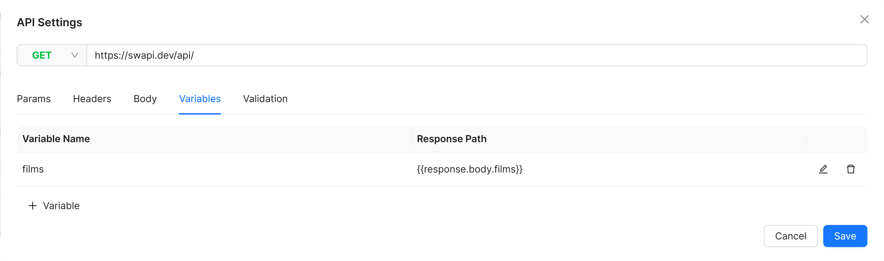{width=5121px height=1513px}

## Вкладка «Validation»

Используется для проверки корректности ответа от API.

Каждая проверка состоит из трёх полей:

| Поле                | Пример                    |
|---------------------|---------------------------|
| **Target**          | `{{response.statusCode}}` |
| **Validation Type** | `=`                       |
| **Expected Value**  | `200`                     |

Поддерживаются операторы:

`=`, `!=`, `>`, `<`, `>=`, `<=`, `IN`, `NOT IN`, `LIKE`

Подробнее о том как работать с объектом `response` см. инструкцию [Работа с response](../rabota-s-json-putyami-i-obektom-response)

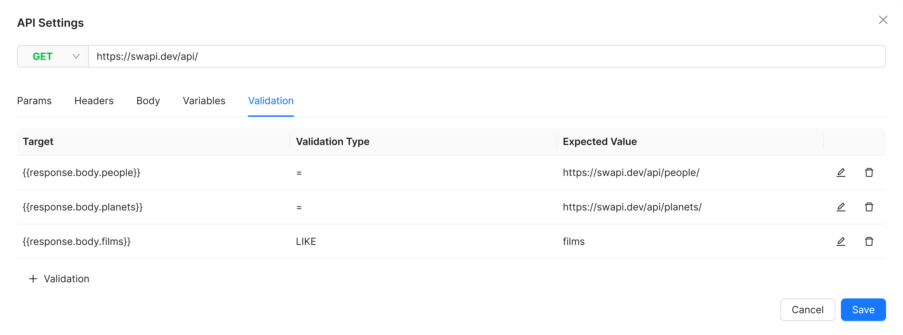{width=5120px height=1904px}

## Импорт CURL

BugBuster поддерживает автоматический импорт запросов из **CURL-строк**.\
Это позволяет быстро перенести запрос из тестируемого приложения прямо в шаг **API Request**, не вводя параметры вручную.

### Как получить CURL из DevTools

1. Откройте тестируемое приложение в браузере.

2. Перейдите во вкладку **Network** в **Developer Tools**.

3. Найдите нужный запрос (например, `/api/login` или `/api/orders`).

4. Кликните по нему правой кнопкой мыши -> **Copy -> Copy as cURL (bash)**.

5. Убедитесь, что формат именно **bash**, а не PowerShell или fetch -- другие форматы могут не распознаться.

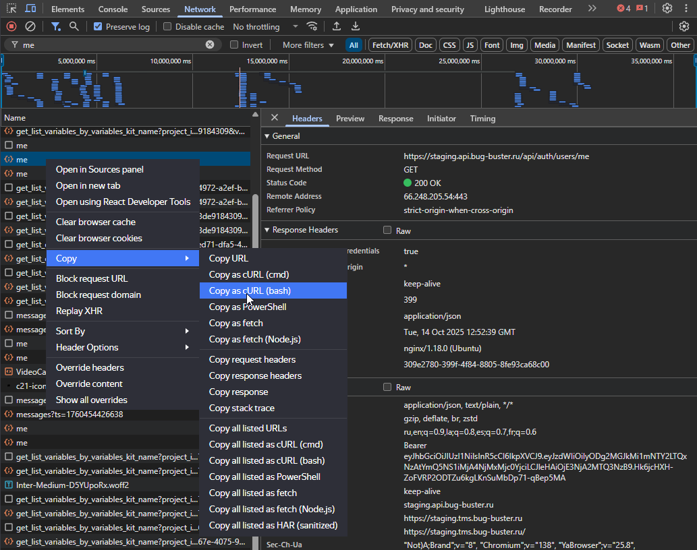{width=1033px height=816px}

### Как вставить CURL в BugBuster

1. Создайте новый шаг **API Request**.

2. Вставьте скопированную CURL-строку в поле ввода.

3. Кликните вне поля -- BugBuster автоматически распарсит запрос и заполнит:

   -  метод (GET, POST и т.д.),

   -  URL,

   -  заголовки (Headers),

   -  тело запроса (Body),

   -  параметры (Params).

Пример:

```
curl -X POST https://tms.bug-buster.ru/api/login \
  -H "Content-Type: application/json" \
  -H "Authorization: Bearer {{token}}" \
  -d '{"email": "{{user_email}}", "password": "{{user_password}}"}'
```

После обработки CURL-строки BugBuster преобразует её в структурированный формат с заполненными вкладками формы.

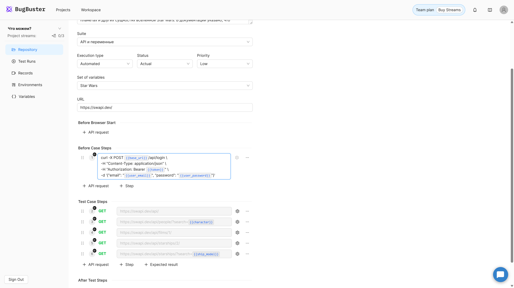{width=1920px height=1080px}

## Частые ошибки и советы

| Проблема                         | Что сделать                                                 |
|----------------------------------|-------------------------------------------------------------|
| Некорректный URL                 | Проверьте наличие `https://`                                |
| Ошибка в JSON теле               | Используйте валидатор JSON перед вставкой                   |
| Не найдено значение по JSON-пути | Убедитесь, что структура ответа соответствует пути          |
| Переменная не подставилась       | Проверьте, выбран ли нужный набор переменных                |
| Ошибка валидации                 | Убедитесь, что сравниваете однотипные данные (строка/число) |