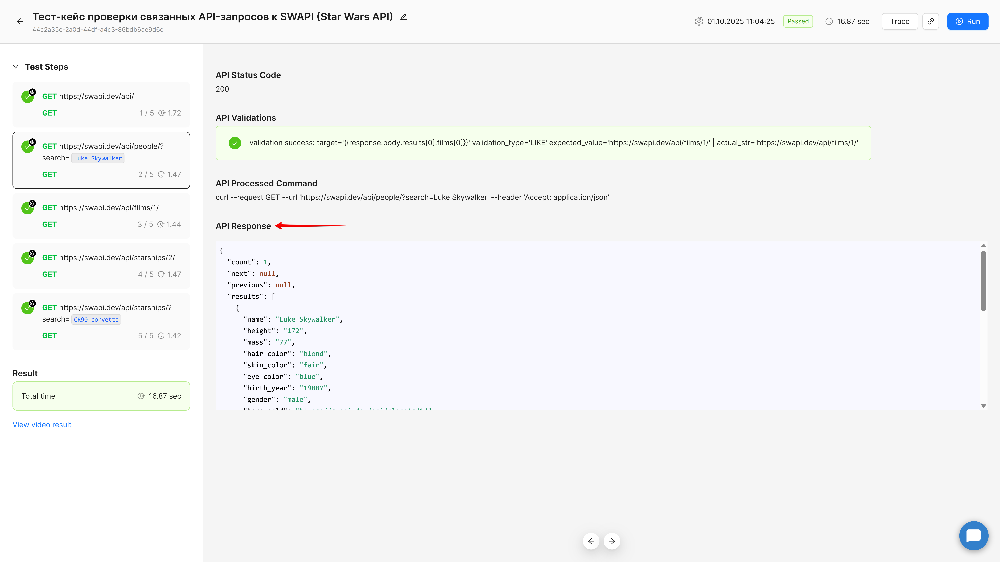

## Назначение

Эта инструкция описывает, как получать нужные данные из ответа на запрос (`response`) при работе с вкладками **Variables** и **Validations**.

Подробнее про эти вкладки см. инструкцию [API request шаги](./rabota-s-api)

## Что такое `response`

После выполнения API-запроса BugBuster сохраняет ответ в объект `response`, который доступен на следующих вкладках:

-  **Variables** -- для записи данных в переменные,

-  **Validation** -- для проверки ожидаемых значений.

## Структура объекта `response`

| Объект                | Содержимое                                             |
|-----------------------|--------------------------------------------------------|
| `response.headers`    | Заголовки HTTP-ответа                                  |
| `response.body`       | Основное тело ответа (JSON, HTML, текст и т.д.)        |
| `response.statusCode` | Код ответа (200, 404 и т.д.)                           |
| `response.text`       | Сырой текст ответа                                     |
| `response.url`        | Итоговый URL запроса после подстановки всех переменных |

Чтобы обратиться к нужному элементу, используйте синтаксис:

```
{{response.<объект>.<путь_до_ключа>}}
```

## Основные правила обращения к данным

-  Каждый путь **всегда заключайте** в `{{ }}`.

-  Вложенные ключи указываются через `.` (точку).

-  Массивы индексируются с нуля, через квадратные скобки `[ ]`.

-  Можно обращаться к любому уровню вложенности.

## Примеры JSON и путей

### Пример 1 -- простой JSON

```
{
  "token": "abc123",
  "status": "ok"
}
```

| Что получить | Какой путь                 |
|--------------|----------------------------|
| Токен        | `{{response.body.token}}`  |
| Статус       | `{{response.body.status}}` |

### Пример 2 -- вложенные объекты

```
{
  "user": {
    "id": 42,
    "profile": { "email": "qa@bugbuster.ai" }
  }
}
```

| Что получить       | Какой путь                             |
|--------------------|----------------------------------------|
| ID пользователя    | `{{response.body.user.id}}`            |
| Email пользователя | `{{response.body.user.profile.email}}` |

### Пример 3 -- массивы

```
{
  "roles": [
    {"id": 1, "name": "admin"},
    {"id": 2, "name": "qa"}
  ]
}
```

| Что получить         | Какой путь                        |
|----------------------|-----------------------------------|
| Название первой роли | `{{response.body.roles[0].name}}` |
| ID второй роли       | `{{response.body.roles[1].id}}`   |

### Пример 4 -- массив верхнего уровня

```
[
  {"id": 11, "name": "John"},
  {"id": 22, "name": "Alice"}
]
```

| Что получить             | Какой путь                  |
|--------------------------|-----------------------------|
| Имя первого пользователя | `{{response.body[0].name}}` |
| ID второго пользователя  | `{{response.body[1].id}}`   |

### Пример 5 -- сложная структура

```
[
  {
    "role_title2": [
      [null, {"test": "QA Engineer"}]
    ]
  }
]
```

| Что получить         | Какой путь                                    |
|----------------------|-----------------------------------------------|
| Значение поля `test` | `{{response.body[0].role_title2[1][1].test}}` |

## Использование в Variables

| Variable Name | Response Path                          |
|---------------|----------------------------------------|
| `token`       | `{{response.body.token}}`              |
| `email`       | `{{response.body.user.profile.email}}` |
| `role`        | `{{response.body.roles[0].name}}`      |

## Использование в Validations

| Target                            | Validation Type | Expected Value |
|-----------------------------------|-----------------|----------------|
| `{{response.statusCode}}`         | `=`             | `200`          |
| `{{response.body.user.id}}`       | `=`             | `42`           |
| `{{response.body.roles[0].name}}` | `LIKE`          | `admin`        |

## Частые ошибки

| Ошибка                            | Как исправить                   |
|-----------------------------------|---------------------------------|
| Забыли фигурные скобки            | Всегда пишите `{{response.…}}`  |
| Неправильный индекс массива       | Индексация начинается с 0       |
| Обращение к несуществующему ключу | Проверьте структуру JSON ответа |
| Некорректный JSON                 | Ответ должен быть валидным      |

## Совет

:::quote 

🔎 Перед тем как указывать путь, запустите тест один раз, откройте выполненный API Request шаг, посмотрите реальный ответ и убедитесь, что путь до ключа верный.

:::

{width=1920px height=1080px}