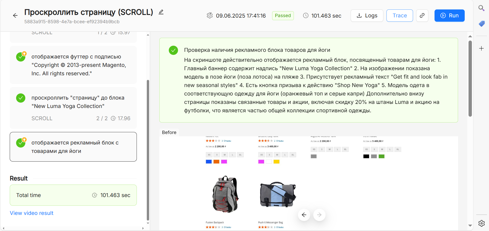
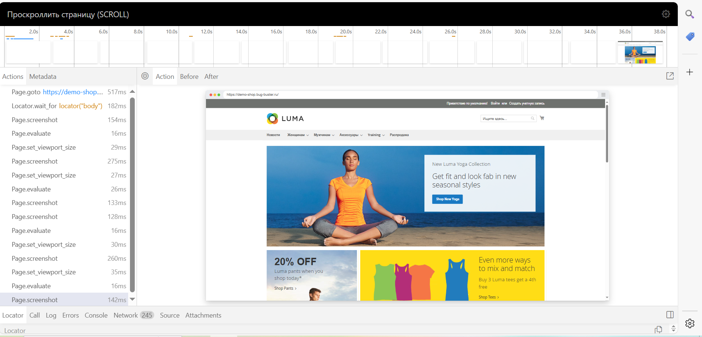

Результаты тестирования представлены в виде списка выполнений с цветовой маркировкой:

-  зеленый (**Passed**) -- тест прошел успешно,

-  красный (**Failed**) -- тест не прошел.

На вкладке **Run History** доступна информация о выполнении предыдущих тестов. [Узнать больше об истории запусков](./istoriya-zapuskov).

Кнопка **Trace** справа в верхней части экрана открывает трейсы:

{width=1912px height=905px}

В отчете фиксируются:

-  **Сетевые запросы.** Запросы и ответы (HTTP/HTTPS) сохраняются в логах теста.

-  **console.log.** Сообщения, выведенные в консоль во время выполнения теста.

-  **DOM-структура.** При падении теста указывается, какой элемент не был найден или не соответствовал ожиданиям.

{width=1912px height=919px}