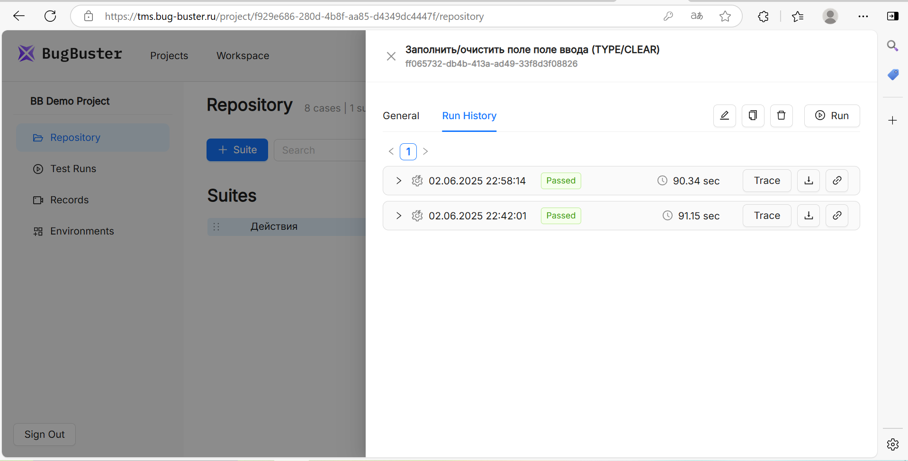
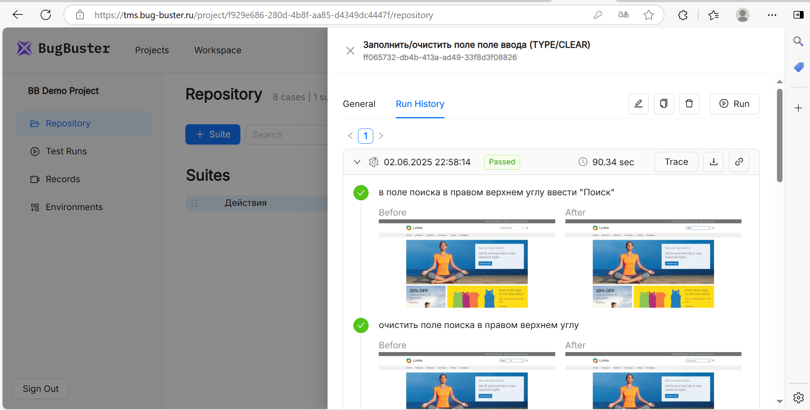

Вы можете открыть историю запусков, чтобы посмотреть, как тест-кейс выполнялся ранее:

{width=1917px height=975px}

История хранит данные о предыдущих прохождениях, включая статусы (**Passed/Failed**), детали шагов и скриншоты (**Before/After**) для каждого шага. Также можно анализировать трейсы, включая сетевые запросы и консольные логи.

{width=1914px height=970px}

Эта функциональность полезна для:

-  анализа стабильности тестов,

-  поиска причин падений,

-  сравнения результатов разных запусков.

В интерфейсе платформы вкладка **Run History** доступна внутри отдельного тест-кейса и внутри тест-рана.