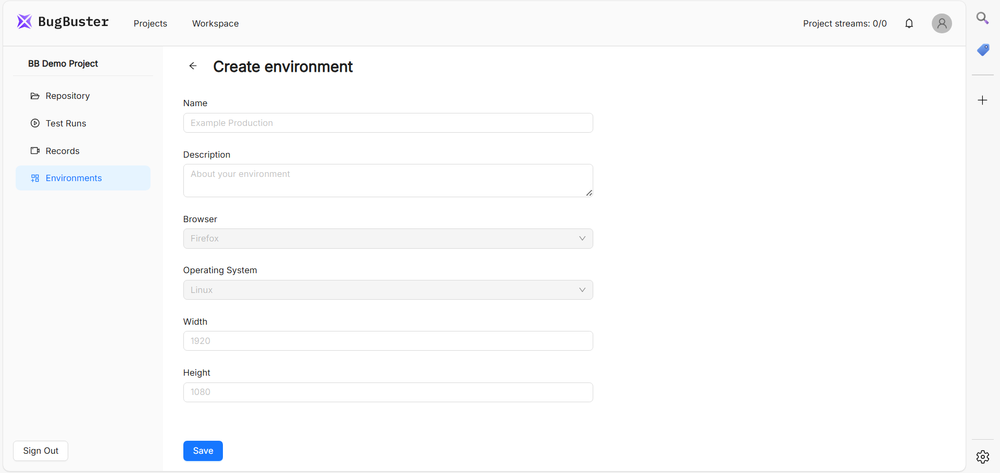

**Environments** используются при запуске тест-ранов для указания, в каких условиях должны выполняться тесты. Это конфигурация, которая определяет следующие параметры:

-  браузер,

-  операционную систему,

-  разрешение экрана.

## Как создать Environment

1. Перейдите в раздел **Environments** в вашем проекте.

2. Нажмите кнопку **\+New Environment**.

3. Выберите браузер из доступных вариантов (на текущий момент поддерживается только Chrome).

4. Укажите операционную систему.

5. Введите расширение экрана. Например, для десктопа (1920×1080) или мобильного устройства (375×812).

6. Сохраните конфигурацию.

{width=1920px height=909px}

:::info 

**Примечание.** В будущем список браузеров и ОС будет расширен. Мобильные разрешения можно имитировать уже сейчас, но нативное тестирование мобильных приложений появится в будущих обновлениях.

:::

## **Как использовать Environments в Test Runs**

При создании **Test Run** (группового запуска тестов):

1. Выберите нужный **Environment** из списка.

2. Укажите **Host** (если требуется подмена URL тестируемого приложения). Например:

   -  Если оставить поле пустым, тесты запустятся на URL, указанных в тест-кейсах.

   -  Если указать *https://example.com*, все тесты будут запущены на этом домене.

3. Запустите **Test Run**. Тесты выполняются в выбранном окружении.