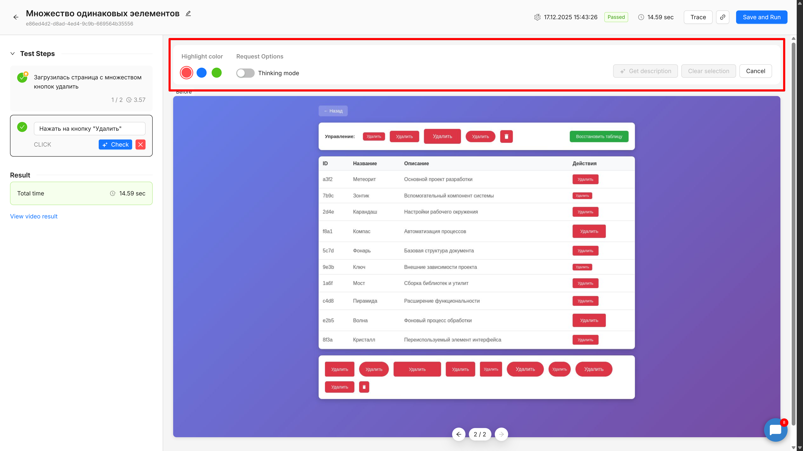
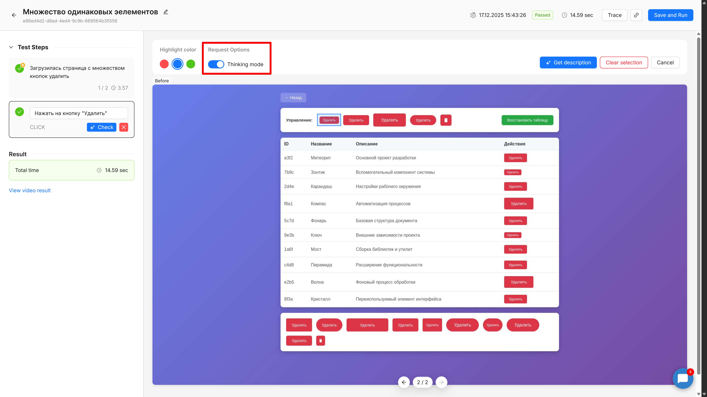
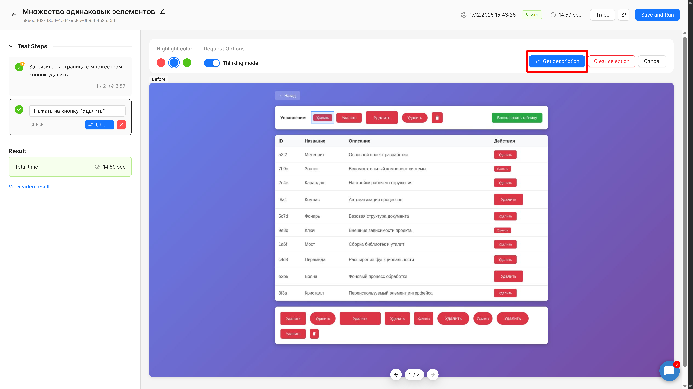

Иногда при выполнении теста система может не найти нужный элемент или найти неправильный элемент. В таких ситуациях вам поможет специальный режим уточнения описания элемента. Этот режим позволяет выделить элемент на скриншоте и получить от платформы точное описание, которое затем можно использовать в своих тестах.

## Когда это нужно

Функция уточнения описания особенно полезна в двух случаях. Первый -- когда тест падает с ошибкой «элемент не найден». Это означает, что система не смогла обнаружить элемент по текущему описанию на странице. Второй случай -- когда тест выполнился, но взаимодействие произошло не с тем элементом, который вы ожидали. Например, вместо кнопки «Сохранить» в форме система нажала похожую кнопку в другой части интерфейса.

В обоих сценариях режим уточнения описания поможет создать более точное и уникальное описание элемента, которое позволит системе безошибочно его находить.

## Открытие режима описания

Для работы с описаниями элементов сначала откройте форму одиночного запуска шага -- тот самый режим, где вы можете проверить выполнение отдельного шага теста. В дебаг режиме над скриншотом появится кнопка **«Define Element»**. Нажатие на эту кнопку переключит интерфейс в специальный режим описания элемента.

{width=7680px height=4320px}

После переключения вы увидите новый интерфейс с несколькими элементами управления: палитру цветов для выделения, исходный скриншот без аннотаций и кнопки для работы с описанием.

{width=7680px height=4320px}

## Выбор цвета выделения

Перед тем как начать выделять элемент, выберите цвет рамки из трёх доступных вариантов: красный, синий или зелёный. Это не просто декоративная функция -- разные цвета помогают, если вам нужно работать с несколькими элементами или делать повторные попытки. По умолчанию выбран красный цвет, но вы можете переключиться на любой другой в любой момент.

Цвет рамки также влияет на то, как модель видит выделенную область -- она учитывает контрастность выделения относительно интерфейса, что может повысить точность описания.

## Выделение элемента

Теперь можно выделить нужный элемент на скриншоте. Для этого зажмите левую кнопку мыши в одном углу элемента и, не отпуская, перетащите курсор к противоположному углу. Во время выделения вы увидите прямоугольную рамку выбранного цвета, которая показывает границы области.

При выделении постарайтесь захватить весь элемент целиком, включая его текст, иконки и границы, но избегайте захвата соседних элементов. Чем точнее вы выделите область, тем более конкретное описание получите от модели.

{width=7680px height=4320px}

В процессе выделения система автоматически рассчитывает координаты прямоугольника относительно исходного изображения. Эти координаты отображаются в интерфейсе в формате `(x1, y1) - (x2, y2)`, где первая пара чисел -- это левый верхний угол, а вторая -- правый нижний угол выделенной области.

Если вы выделили неточно или хотите попробовать другую область, нажмите кнопку **«Clear Selection»** -- текущее выделение исчезнет, и вы сможете выделить элемент заново.

## Режим размышлений

Под областью выделения находится переключатель **«Thinking Mode»**. Когда он включён (по умолчанию), модель использует внутреннее «размышление» перед тем, как сгенерировать описание. Это означает, что модель сначала анализирует контекст элемента, его положение на странице, окружающие элементы, и только потом формирует итоговое описание.

Режим размышлений повышает качество описаний, особенно для сложных элементов или элементов без явного текста (иконки, кнопки с символами). Однако он увеличивает время обработки запроса на несколько секунд. В большинстве случаев рекомендуется оставлять этот режим включённым.

## Получение описания

Когда элемент выделен, кнопка **«Get Description»** становится активной. Нажмите её, чтобы отправить запрос на генерацию описания. На экране появится индикатор загрузки -- обычно обработка занимает от 3 до 15 секунд в зависимости от сложности элемента и включенных настроек.

Система работает умно: она не просто генерирует описание, но и автоматически проверяет его качество. После генерации описания система пытается найти элемент по этому описанию на том же скриншоте. Если найденные координаты попадают в выделенную вами область, описание считается успешным. Если нет -- система автоматически делает вторую попытку, используя более точный режим и учитывая предыдущий результат.

Этот процесс верификации происходит прозрачно для вас -- вам не нужно ничего делать дополнительно. Вы просто ждёте результата.

## Результат описания

После завершения обработки на экране появляется результат. Вы увидите сгенерированное описание элемента -- короткий текст, обычно менее 200 символов, который точно характеризует выделенный элемент.

{width=7680px height=4320px}

Важная особенность: после получения результата на экране снова отображается исходный скриншот без каких-либо выделений или аннотаций. Это сделано специально, чтобы вы могли сразу же выделить другую область и получить новое описание, не возвращаясь в предыдущий режим. Таким образом можно последовательно получить описания для нескольких элементов.

Кроме самого описания, вы увидите координаты выделенной области и время обработки запроса. Эта информация полезна для понимания, насколько точно вы выделили элемент.

## Копирование и использование описания

Рядом с полученным описанием находится кнопка **«Copy»**. Нажмите её, чтобы скопировать описание в буфер обмена. Теперь вы можете вставить это описание в поле описания элемента в вашем шаге теста.

Откройте редактирование шага, найдите место, где нужно указать элемент (например, «Нажать на кнопку...» или «Ввести текст в поле...»), и вставьте скопированное описание. Описание можно использовать как есть, или при необходимости немного отредактировать для большей ясности.

## Проверка описания

После того как вы вставили описание в шаг, рекомендуется проверить, правильно ли система его интерпретирует. Для этого нажмите кнопку **«Check»** в форме одиночного запуска шага.

При нажатии на **«Check»** произойдёт несколько вещей автоматически. Форма описания элемента закроется, режим выделения сбросится, и вы вернётесь в обычный режим проверки. На экране отобразится аннотированный скриншот с точкой или областью, где система нашла элемент по вашему описанию, а также плашка с координатами и временем обработки.

{width=7680px height=4320px}

Это позволяет визуально убедиться, что описание работает правильно и система находит именно тот элемент, который вам нужен. Если координаты совпадают с вашими ожиданиями -- отлично, можно сохранять шаг и использовать его в тестах. Если нет -- попробуйте уточнить описание или вернуться в режим «Define Element» и выделить область иначе.

## Повторное выделение

Если первое описание вас не устроило или вы хотите попробовать описать элемент по-другому, не нужно закрывать режим описания. Просто выделите новую область на скриншоте (или ту же самую, но с другим цветом рамки для наглядности), и снова нажмите **«Get Description»**.

Новое выделение заменит предыдущее, и вы получите новое описание. Можно экспериментировать с разными границами выделения -- иногда небольшое изменение области даёт более точное или более универсальное описание.

## Работа с несколькими элементами

Если вам нужно получить описания для нескольких элементов на одной странице, процесс очень прост. Получите описание первого элемента, скопируйте его и сохраните где-то (например, вставьте в соответствующий шаг теста). Затем, не выходя из режима описания, выделите второй элемент и получите его описание. Повторите процесс для всех нужных элементов.

Система сохраняет исходный скриншот без изменений, поэтому вы можете работать последовательно со сколькими угодно элементами, не теряя контекст и не перезагружая интерфейс.

## Переключение между шагами

В режиме описания элемента есть определённые ограничения на навигацию. Когда вы находитесь в режиме «Define Element», переключение между шагами может быть недоступно или приведёт к сбросу текущего состояния (выделенной области, полученного описания).

Поэтому рекомендуется завершить работу с текущим шагом -- получить все нужные описания, скопировать их и проверить -- прежде чем переходить к следующему шагу. Если вам нужно прервать процесс, нажмите кнопку **«Cancel»**, чтобы выйти из режима описания и вернуться к обычному дебаг режиму.

## Что делать при ошибках

Иногда система может не справиться с генерацией описания для выделенной области. Это может произойти, если область выделена слишком маленькой, захватывает несколько разных элементов одновременно, или если элемент имеет очень сложную визуальную структуру.

В таком случае вы увидите сообщение об ошибке с предложением скорректировать выделение и попробовать снова. Попробуйте изменить границы выделения -- сделайте область чуть больше или чуть меньше, убедитесь, что вы захватываете только один логический элемент интерфейса.

Если ошибка повторяется, попробуйте включить режим **«Thinking Mode»**, если он был выключен, или измените цвет выделения -- иногда это помогает модели лучше распознать элемент.

## Технические ограничения

Минимальный размер выделяемой области -- 10 на 10 пикселей. Если вы попытаетесь выделить область меньше, кнопка **«Get Description»** останется неактивной. Также убедитесь, что выделение полностью находится внутри границ скриншота.

Время обработки одного запроса обычно не превышает 15 секунд. Если запрос выполняется дольше, возможны проблемы с соединением или загруженностью сервера -- попробуйте повторить запрос через некоторое время.

Полученные описания оптимизированы для использования в тестах -- они краткие (менее 200 символов) и содержат только релевантную информацию о элементе. Если описание кажется слишком общим, попробуйте выделить область более точно или добавьте контекст вручную при редактировании шага.

:::tip 

Для элементов без явного текста (иконки, графические кнопки) описания могут включать информацию о форме, цвете и положении элемента. Такие описания обычно более надёжны, чем ссылки на текст, который может измениться при локализации интерфейса.

:::

## Советы по эффективному использованию

Чтобы получать максимально точные описания, старайтесь выделять элемент с небольшим отступом -- захватывайте сам элемент, но не слишком много пустого пространства вокруг. Если элемент имеет подпись или иконку, включите их в выделение.

Для кнопок и ссылок выделяйте всю кликабельную область целиком. Для полей ввода включайте метку поля (например, «Email:» или «Пароль:»), если она находится рядом -- это даёт модели больше контекста.

Если элемент расположен в списке или таблице, выделяйте только сам элемент, а не строку или ячейку целиком, если это возможно. Однако если элемент уникален только в контексте строки (например, кнопка «Удалить» в третьей строке таблицы), можно выделить область шире, чтобы захватить контекст.

Используйте разные цвета выделения, когда работаете с похожими элементами -- это помогает визуально различать, какое описание для какого элемента было получено.

:::note 

Описания генерируются на основе визуального анализа скриншота и не имеют доступа к HTML-структуре страницы. Это означает, что описания будут работать одинаково хорошо для любых типов интерфейсов -- веб-приложений, мобильных приложений или десктопных программ.

:::