## Назначение

Справочник переменных -- это инструмент, который позволяет сохранять и переиспользовать значения в шагах тест-кейсов.

С его помощью можно:

-  хранить токены авторизации, логины, пароли и другие данные;

-  подставлять значения в UI-действиях и API-запросах;

-  сохранять результаты ответов API и использовать их в последующих шагах.

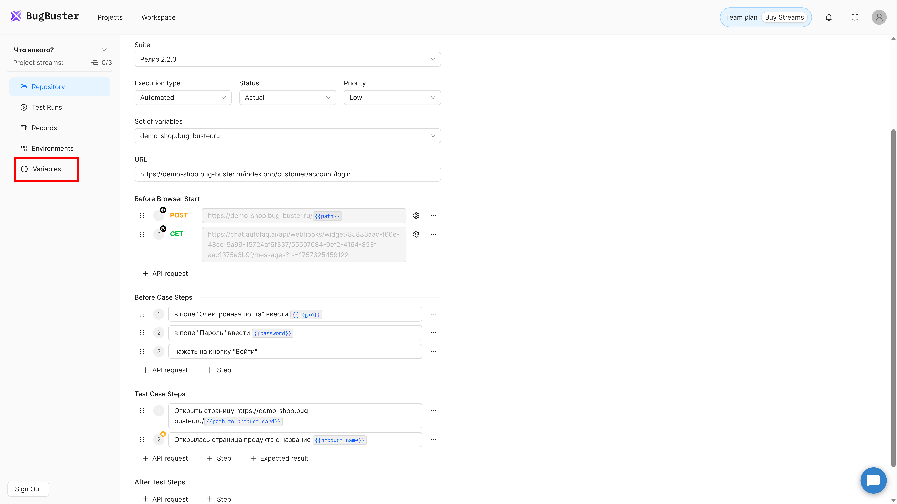{width=1920px height=1080px}

## Переход к справочнику переменных

1. Откройте нужный проект.

2. В боковом меню выберите пункт **Variables**.

3. Откроется страница со списком наборов переменных.

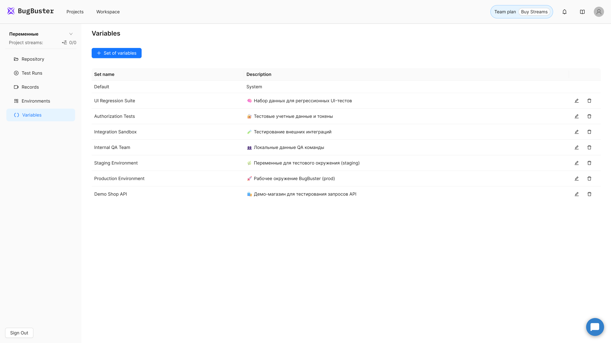{width=1920px height=1080px}

:::quote 

💡 **Примечание:**

Переменные хранятся внутри конкретного проекта и не пересекаются между проектами.

:::

## Список наборов переменных

### Что такое набор

Набор переменных -- это группа переменных и их значений, которую можно выбрать при запуске теста.

Например:

-  **Default** -- используется по умолчанию, если не выбран другой набор;

-  **Staging Environment** -- значения для тестового окружения;

-  **Production Environment** -- значения для реального окружения.

### Создание набора

1. Нажмите кнопку **Set of variables**.

2. В открывшейся форме укажите:

   -  **Name** -- обязательное поле, название набора, которое будет отображаться при выборе на форме редактирования тест-кейса или тест рана.

   -  **Description** -- необязательно, описание набора переменных, например, “переменные для тестового API”.

3. Нажмите **Create**.

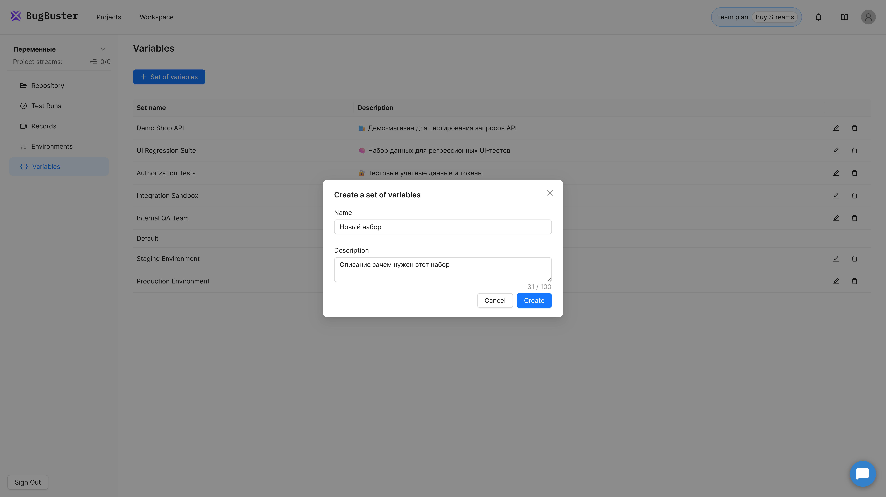{width=1920px height=1080px}

### Редактирование набора

1. Нажмите иконку редактирования рядом с нужным набором.

2. Внесите изменения в название или описание.

3. Нажмите **Save**.

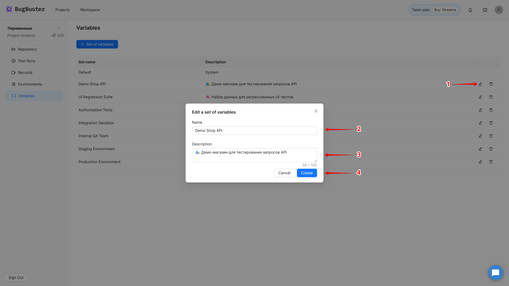{width=1920px height=1080px}

### Удаление набора

1. Нажмите иконку корзины рядом с набором.

2. В появившемся окне подтвердите удаление.

   Отобразится модальное окно с подтверждением удаления и количеством переменных, содержащихся в  удаляемом наборе.

3. Нажмите **Delete**.

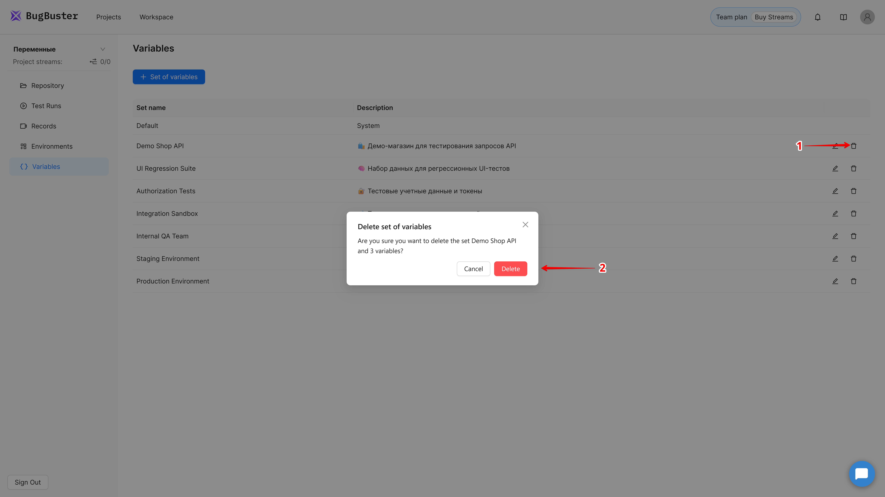{width=1920px height=1080px}

:::quote 

⚠️ Набор **Default** удалить нельзя -- он используется системой как резервный.

:::

### Указание набора переменных в тест-кейсе

Каждый тест-кейс в BugBuster может использовать один из заранее созданных **наборов переменных**. Это позволяет запускать один и тот же тест с разными данными -- например, на тестовом окружении, демо или проде.

#### На форме создания/редактирования тест-кейса

1. Откройте форму **создания** или **редактирования тест-кейса**.

2. Выберите нужный набор переменных в выпадающем списке **Set of variables**

   -  Если ничего не выбрано -- используется **Default** набор.

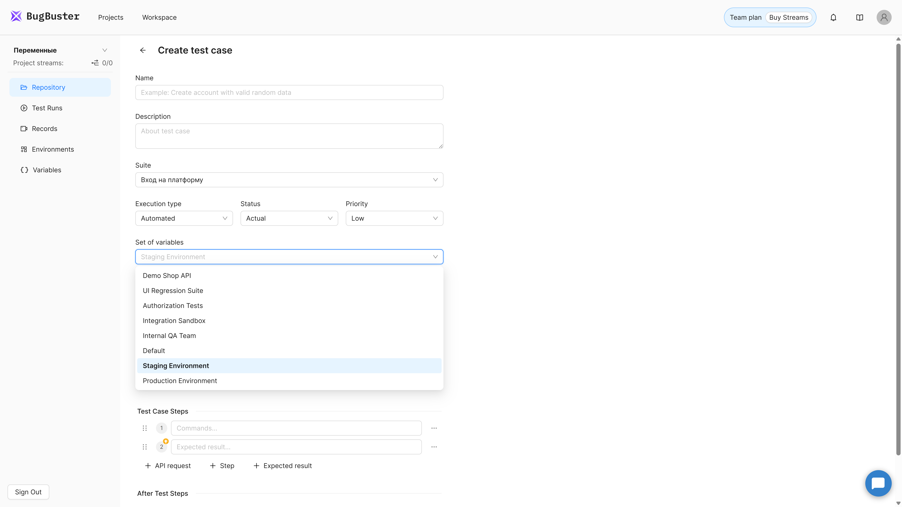{width=1920px height=1080px}

#### На форме создания/редактирования TestRun

1. Откройте форму **создания** или **редактирования тест-рана**.

2. Выберите нужный набор переменных в выпадающем списке **Set of variables**. Этот набор будет применен ко всем запущенным в рамках тест-рана тест-кейсам.

   -  Если ничего не выбрано -- для каждого тест-кейса используется указанный в тест-кейсе набор, если и там ничего не указано, то используется **Default** набор.

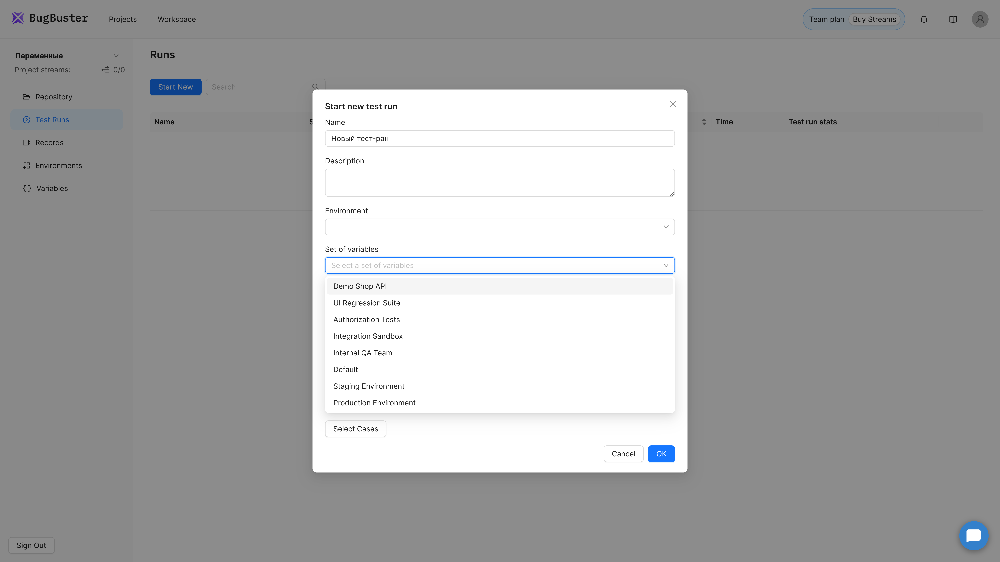{width=1920px height=1080px}

#### Пример

1. У вас есть два набора:

   -  `Staging Environment` -- тестовое окружение;

   -  `Production Environment` -- рабочее окружение.

2. В тест-кейсе выбрано `Staging Environment`.

3. При запуске через групповой ран вы можете выбрать `Production Environment`, чтобы использовать реальные данные.

Таким образом, один и тот же тест-кейс может без изменений выполняться на разных окружениях, просто за счёт выбора нужного набора переменных.

## Просмотр и редактирование переменных в наборе

### Открытие набора

Кликните по названию набора -- откроется страница со списком переменных.

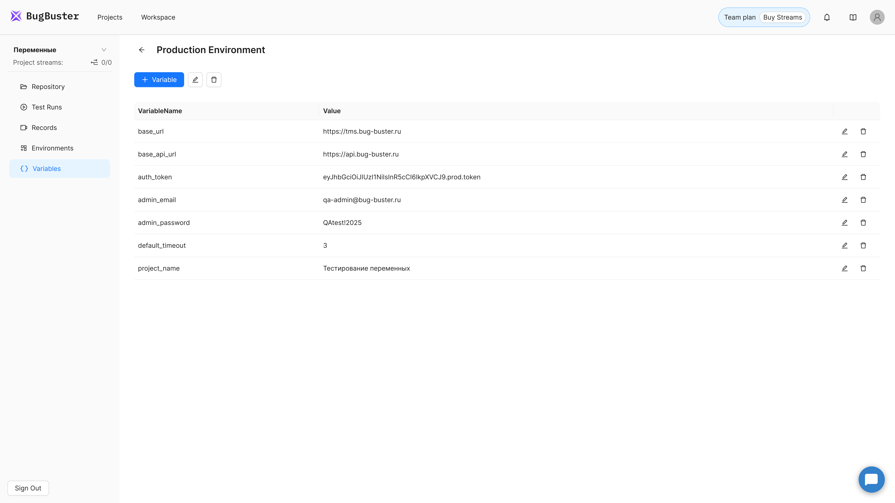{width=1920px height=1080px}

### Создание переменной

1. Нажмите кнопку **«+Variable»**.

2. В открывшейся форме укажите:

   -  **Variable name**  -- обязательное поле, название переменной

   -  **Value** -- значение, может быть пустым (например, если переменная будет переопределяться в API-шаге).

3. (Опционально) Отметьте галочку **Create another**, чтобы после создания сразу добавить следующую.

4. Нажмите **Create**.

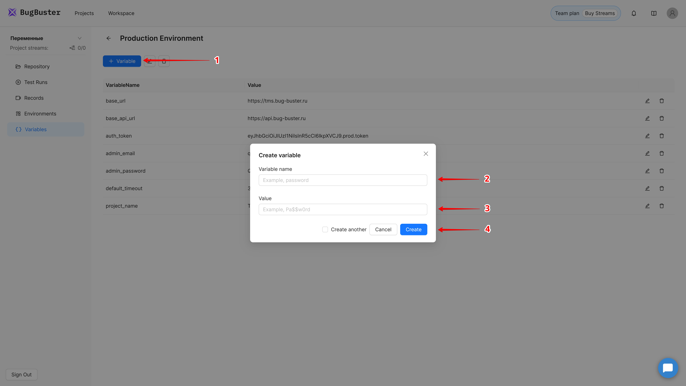{width=1920px height=1080px}

### Правила именования переменных

-  до 255 символов;

-  без пробелов;

-  только латиница;

-  уникальное имя внутри одного набора;

-  рекомендуется использовать нижнее подчёркивание: `user_email`, `token`, `orderId`.

### Редактирование переменной

1. Нажмите иконку редактирования рядом с переменной.

2. Внесите изменения и сохраните.

   Все правила валидации применяются повторно.

### Удаление переменной

1. Нажмите на иконку корзины рядом с нужной переменной.

2. Подтвердите удаление в открывшемся окне.

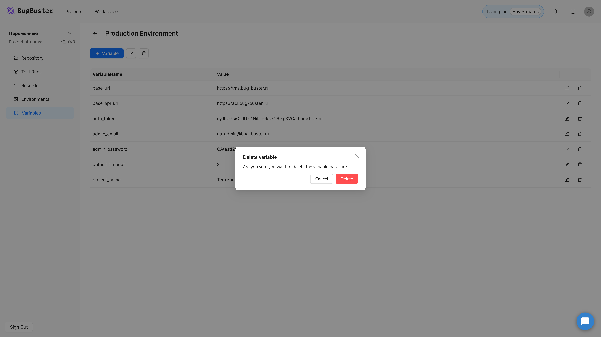{width=1920px height=1080px}

## Где можно использовать переменные?

Переменные можно применять в следующих местах:

| Где используется                       | Пример                                        |
|----------------------------------------|-----------------------------------------------|
| В шагах UI (ввод текста, клики и т.п.) | `ввести в поле логина {{login}}`              |
| В шагах API Request                    | `"Authorization": "Bearer {{token}}"`         |
| В проверках Validation                 | `{{response.statusCode}} = {{expected_code}}` |

📎 *Подробнее о работе с API-запросами см. инструкцию* [Работа с API](http://tauri.localhost/gitlab.demo.screenmate.ai/gramax_group/rukovodstvo-polzovatelya/api_steps/-/rabota-s-api)

## Указание переменных в шагах

Переменные можно использовать **в любом шаге**, где вы вводите текст, значение или проверку.\
Они помогают избежать дублирования данных и делают тесты гибкими -- достаточно один раз изменить значение переменной в справочнике, и оно автоматически обновится во всех шагах, где она используется.

### Синтаксис

Чтобы использовать переменную, заключите её имя в двойные фигурные скобки:

```
{{variable_name}}
```

Пример:

```
ввести в поле логина {{login}}
нажать на кнопку “{{login_button}}”
```

При запуске теста система автоматически подставит значения из выбранного набора переменных.

Как только в шаге вы укажете `{{` появится автокомплит, который основывается на указанном в тест-кейсе наборе переменных.

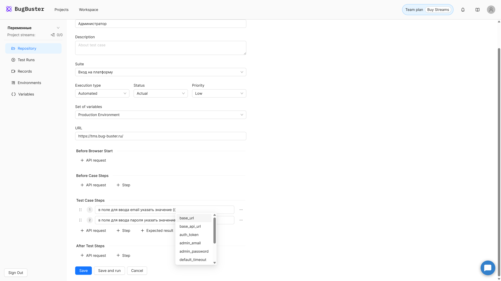{width=1920px height=1080px}

## Как работает подстановка переменных

1. При **сохранении тест-кейса** система воспринимает конструкции `{{variable}}` как ссылки на данные.

2. При **запуске теста** значения автоматически подставляются из выбранного набора.

3. Если в выбранном наборе нет нужной переменной, используется значение из набора **Default**.

4. При **выполнении шагов API** переменные могут быть переопределены (например, токен из ответа сохраняется в ту же переменную `{{token}}`).

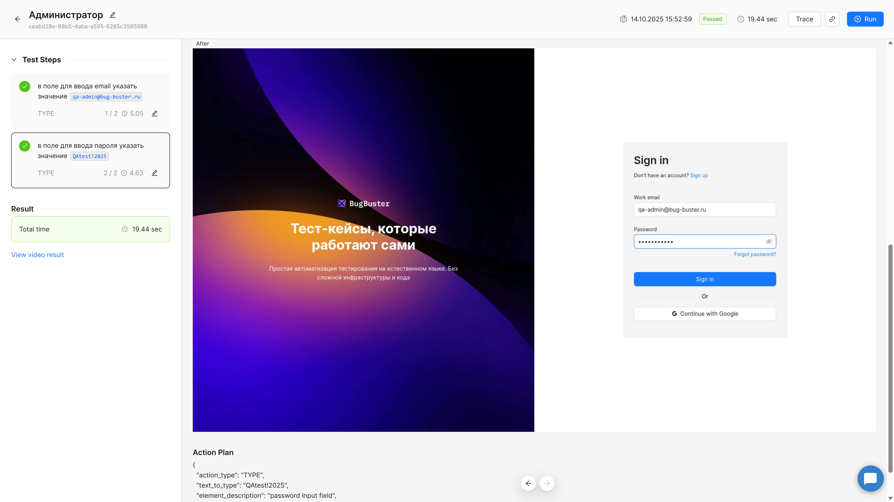{width=1920px height=1080px}

## Отображение переменных

-  На форме **просмотра тест-кейса** переменные отображаются в фигурных скобках -- `{{login}}`.

-  На форме **одиночного запуска** показываются уже значения переменных из набора (например, `test_user`).

-  В истории прохождений можно видеть, какие значения были подставлены при каждом запуске.

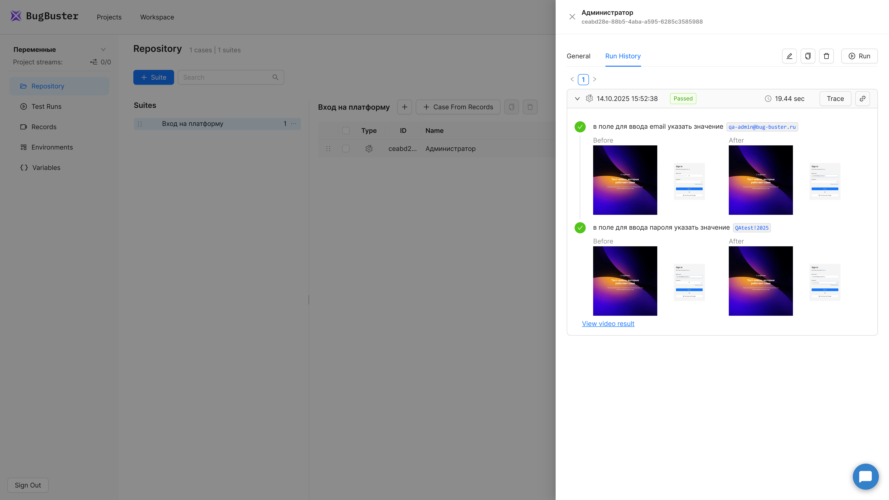{width=1920px height=1080px}

## Примеры

### Пример 1. Авторизация

| Название | Значение   |
|----------|------------|
| login    | test_user  |
| password | Pa\$\$w0rd |

Использование в шаге:

```
ввести в поле логина {{login}}
ввести в поле пароля {{password}}
нажать на кнопку “Войти”
```

---

### Пример 2. Переопределение токена из API

1. Создайте переменную `token` в наборе.

2. В API-шаге укажите сохранение `{{response.body.token}} → {{token}}`.

3. В последующих шагах используйте `{{token}}` -- система подставит новое значение.

📎 *См. также раздел “Variables” в инструкции по API-запросам.*

---

## Советы и лучшие практики

-  Используйте понятные названия (`user_id`, `cart_token`).

-  Старайтесь избегать дублирования.

-  Создавайте отдельные наборы под разные окружения (Dev, Stage, Prod).

-  Проверяйте значения перед запуском теста, особенно при автоматическом переопределении.