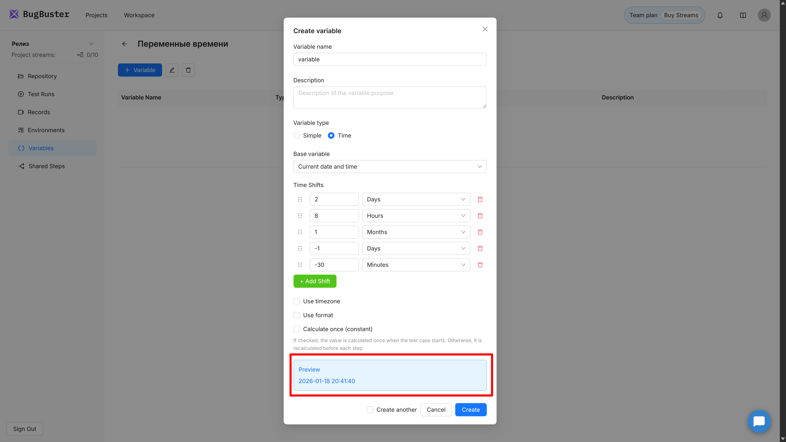
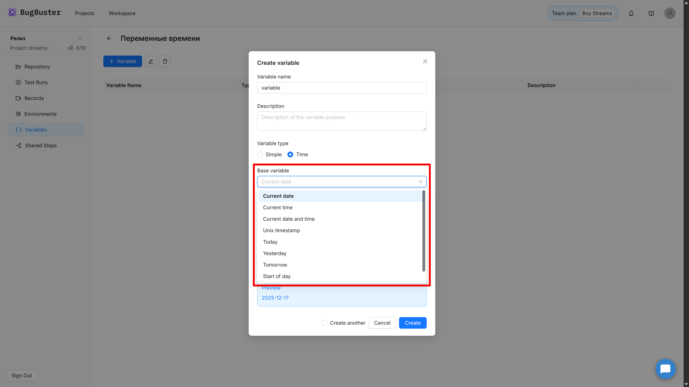
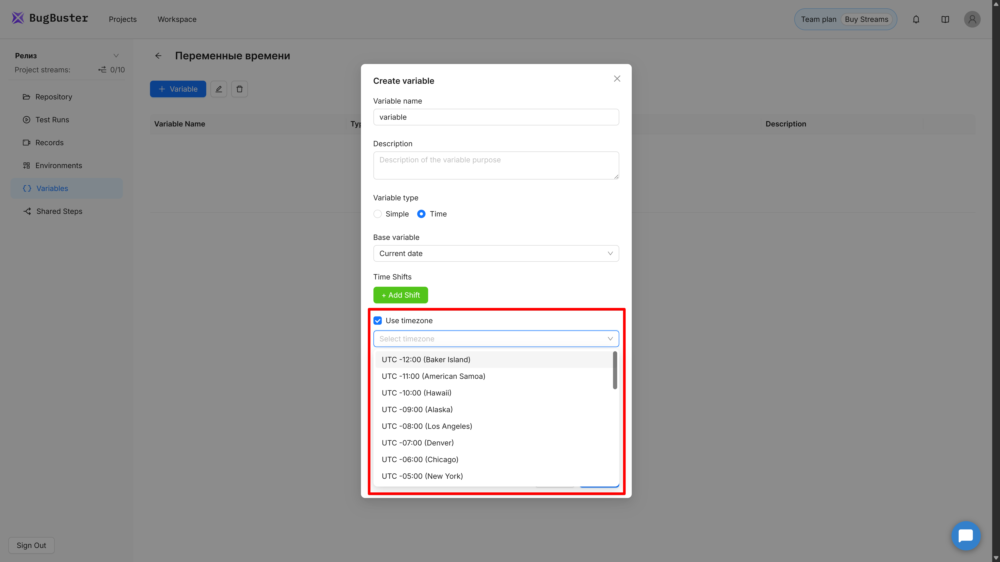
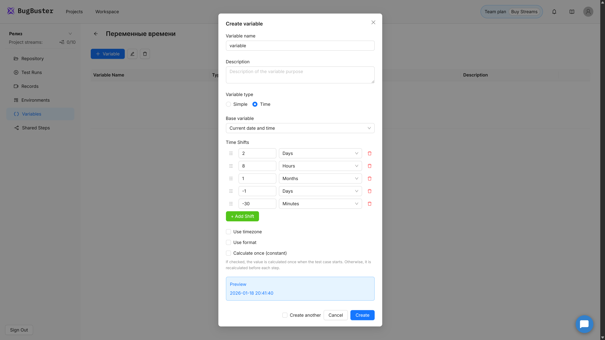
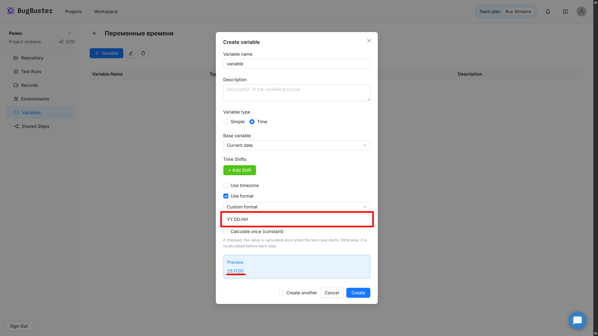
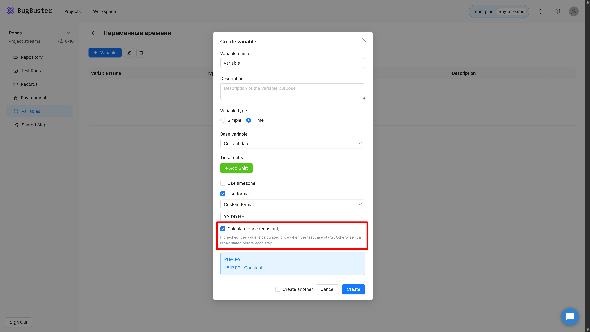
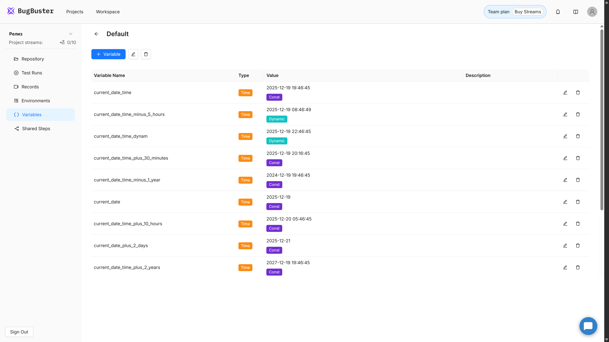

## Что это такое

Системные переменные времени -- это особый тип переменных, которые автоматически вычисляются на основе текущей даты и времени. Вместо того чтобы вручную вводить и обновлять даты в тестах, вы можете использовать переменные, которые сами подстраиваются под текущий момент.

Например, если вашему тесту нужна "завтрашняя дата" или "время через 2 часа", достаточно один раз настроить переменную -- и она всегда будет актуальной при каждом запуске теста.

## Когда это нужно

Системные переменные времени особенно полезны, когда в вашем приложении есть:

-  **Дедлайны и сроки** -- нужно указать дату завершения задачи, срок действия документа

-  **Фильтры по датам** -- выбрать период "с сегодня по следующую неделю"

-  **Временные метки** -- записать время создания заказа, регистрации пользователя

-  **Напоминания и уведомления** -- настроить отправку через определённое время

-  **Бронирования и расписания** -- указать дату и время встречи, бронирования

Вместо того чтобы каждый раз редактировать тест-кейс с новыми датами, вы настраиваете переменную один раз, и она автоматически вычисляет нужное значение при каждом запуске.

## Типы переменных

В справочнике переменных теперь поддерживаются два типа переменных, которые вы увидите при создании:

### Простая переменная (Simple)

Это обычная переменная, в которую вы вводите любое значение: текст, число, URL. Значение остаётся неизменным, пока вы сами его не отредактируете.

**Пример:** переменная `apiUrl` со значением `https://api.example.com`

### Переменная времени (Time)

Это системная переменная, которая автоматически вычисляется на основе текущей даты и времени. Вы настраиваете правила вычисления один раз, а система подставляет актуальное значение при каждом запуске теста.

**Пример:** переменная `deadlineDate`, которая всегда возвращает "завтра в 15:00"

{width=2044px height=511px}

## Создание переменной времени

### Открытие формы создания

1. Откройте нужный набор переменных в разделе **Variables**.

2. Нажмите кнопку **«+Variable»**.

3. В открывшейся форме выберите тип **«Время»**.

После выбора типа "Время" появится специальный конструктор для настройки вычисления даты.

{width=542px height=860px}

### Заполнение основных полей

Укажите название и описание переменной:

-  **Variable name** -- имя переменной, которое вы будете использовать в шагах тест-кейса. Например, `deadlineDate`, `startTime`, `tomorrowDate`.

-  **Description** -- опциональное поле для пояснения, зачем нужна эта переменная. Например, "Дедлайн задачи через 2 дня".

## Настройка вычисления времени

Конструктор переменных времени состоит из нескольких шагов, которые применяются последовательно. Вы выбираете базовую точку отсчёта, затем можете применить к ней различные модификации.

### Шаг 1: Выбор базовой переменной

Это отправная точка для вычислений -- момент времени, от которого будут отсчитываться все изменения.

В выпадающем списке **«Базовая переменная»** выберите один из вариантов:

-  **Текущая дата** -- сегодняшняя дата без времени

-  **Текущее время** -- текущее время без даты

-  **Текущие дата и время** -- полная временная метка с датой и временем

-  **Unix-время** -- количество секунд с 1 января 1970 года

-  **Сегодня** -- то же самое, что "Текущая дата"

-  **Вчера** -- вчерашняя дата

-  **Завтра** -- завтрашняя дата

-  **Начало дня** -- сегодняшняя дата в 00:00:00

-  **Конец дня** -- сегодняшняя дата в 23:59:59

{width=525px height=862px}

:::tip 

Если вам нужно работать с конкретным временем суток (например, "завтра в полночь"), выбирайте **«Начало дня»** и добавьте сдвиг на +1 день. Так вы получите ровно 00:00:00 завтрашнего дня.

:::

### Шаг 2: Указание часового пояса (опционально)

Если ваше приложение работает в определённом часовом поясе, отличном от серверного, вы можете указать его явно.

1. Установите галочку **«Использовать часовой пояс»**.

2. В появившемся выпадающем списке выберите нужный пояс:

   -  UTC+0 (Лондон)
   -  UTC+3 (Москва)
   -  UTC+5:30 (Индия)
   -  UTC-5 (Нью-Йорк)
   -  и другие

3. Если нужного пояса нет в списке, введите его вручную в формате `+HH:MM` или `-HH:MM`.

{width=540px height=1024px}

:::note 

Часовой пояс преобразует время в указанное представление, но не сдвигает сам момент времени. Если сейчас 12:00 UTC, то при указании UTC+3 вы получите 15:00 -- это тот же момент времени, но в другом поясе.

:::

### Шаг 3: Добавление сдвигов времени (опционально)

Сдвиги позволяют добавить или вычесть определённый период времени. Например, "через 2 дня" или "минус 30 минут".

1. Нажмите кнопку **«+ Добавить сдвиг»**.

2. Появится строка с двумя полями:

   -  **Число** -- сколько единиц времени добавить или вычесть (положительное или отрицательное)
   -  **Единица измерения** -- выберите из списка: секунды, минуты, часы, дни, месяцы, годы

3. Для удаления сдвига нажмите иконку корзины справа от строки.

4. Вы можете добавить несколько сдвигов -- они применяются последовательно.

{width=535px height=962px}

**Примеры:**

-  `+2` дня, `+8` часов -> через 2 дня и 8 часов
-  `+1` месяц, `-1` день -> через месяц минус один день (последний день текущего месяца через месяц)
-  `-30` минут -> 30 минут назад

:::note 

Порядок сдвигов может быть важен при работе с месяцами и днями на границах месяцев. Например, "30 января + 1 месяц + 1 день" даст другой результат, чем "30 января + 1 день + 1 месяц".

:::

### Шаг 4: Выбор формата вывода (опционально)

Формат определяет, как дата и время будут отображаться в итоговом значении переменной.

1. Установите галочку **«Использовать формат»**.

2. В выпадающем списке выберите один из популярных форматов:

   -  `YYYY-MM-DD` -> 2025-11-04
   -  `DD.MM.YYYY` -> 04.11.2025
   -  `YYYY-MM-DD HH:mm:ss` -> 2025-11-04 14:30:45
   -  `HH:mm:ss` -> 14:30:45
   -  `X` -> Unix секунды (1730716800)
   -  `x` -> Unix миллисекунды (1730716800000)
   -  **Пользовательский формат** -> введите свой

3. Если выбрали "Пользовательский формат", появится текстовое поле для ручного ввода.

{width=533px height=1042px}

:::tip 

Если вы не укажете формат, система применит формат по умолчанию в зависимости от базовой переменной. Например, для "Текущая дата" это будет `YYYY-MM-DD`, а для "Текущие дата и время" -- `YYYY-MM-DD HH:mm:ss`.

:::

**Доступные элементы формата:**

| Элемент | Описание          | Пример        |
|---------|-------------------|---------------|
| YYYY    | Год (4 цифры)     | 2025          |
| YY      | Год (2 цифры)     | 25            |
| MM      | Месяц (01-12)     | 03            |
| M       | Месяц (1-12)      | 3             |
| DD      | День (01-31)      | 05            |
| D       | День (1-31)       | 5             |
| HH      | Часы (00-23)      | 14            |
| H       | Часы (0-23)       | 14            |
| mm      | Минуты (00-59)    | 07            |
| m       | Минуты (0-59)     | 7             |
| ss      | Секунды (00-59)   | 09            |
| s       | Секунды (0-59)    | 9             |
| X       | Unix секунды      | 1710504645    |
| x       | Unix миллисекунды | 1710504645000 |

### Шаг 5: Режим вычисления

Режим определяет, когда именно система будет вычислять значение переменной.

Установите галочку **«Вычислять один раз (константа)»**, если хотите, чтобы значение вычислялось один раз в начале запуска тест-кейса и оставалось неизменным до конца выполнения.

Если галочка не установлена, переменная будет **динамической** -- её значение пересчитывается перед каждым шагом теста.

{width=528px height=1047px}

**Когда использовать константу:**

-  Вам нужна одна и та же дата/время на протяжении всего теста
-  Вы заполняете форму с дедлайном, который должен быть одинаковым в нескольких полях
-  Тест проверяет согласованность данных по времени

**Когда использовать динамическое значение:**

-  Тест длительный, и время должно обновляться между шагами
-  Вы проверяете актуальность данных "прямо сейчас"
-  Каждый шаг должен видеть новое время

### Предпросмотр конфигурации

В нижней части формы отображается человекочитаемое описание того, как будет вычисляться переменная. Это описание обновляется в реальном времени при изменении настроек.

**Пример:**

`Начало дня (UTC+3) + 1 день + 3 часа | Формат: YYYY-MM-DD HH:mm | Константа`

Это означает: берём начало текущего дня (00:00:00) в часовом поясе UTC+3, добавляем 1 день и 3 часа, выводим в формате "год-месяц-день час:минута", и значение вычисляется один раз при запуске.

{width=532px height=1068px}

### Сохранение переменной

После заполнения всех полей нажмите кнопку **«Create»** или **«Save»** (в зависимости от того, создаёте вы новую переменную или редактируете существующую).

Переменная появится в таблице справочника переменных с вычисленным значением на текущий момент.

## Отображение в справочнике

После создания переменная отображается в таблице со следующими колонками:

| Колонка  | Что отображается                                        |
|----------|---------------------------------------------------------|
| Имя      | Название переменной (например, `deadlineDate`)          |
| Тип      | Цветной бейдж: **Simple** (синий) или **Time** (жёлтый) |
| Значение | Вычисленное значение согласно формату + бейдж режима    |
| Описание | Комментарий, который вы указали при создании            |
| Действия | Кнопки редактирования и удаления                        |

Для переменных типа "Время" рядом со значением отображается дополнительный бейдж:

-  **Const** -- значение вычисляется один раз при запуске тест-кейса
-  **Dynamic** -- значение пересчитывается перед каждым шагом

При наведении на бейджи появляются подсказки с пояснениями.

{width=2044px height=511px}

:::note 

Значение переменной времени в таблице показывает, какое значение будет использоваться **прямо сейчас**, если запустить тест. Это помогает сразу увидеть, правильно ли настроена переменная.

:::

## Использование в тест-кейсах

Переменные времени используются в шагах тест-кейсов точно так же, как обычные переменные.

### Синтаксис

Заключите имя переменной в двойные фигурные скобки:

```
{{deadlineDate}}
```

### Примеры использования в шагах

```
Ввести в поле "Дата завершения" {{deadlineDate}}
Нажать на день {{tomorrowDate}} в календаре
Проверить, что время создания {{currentDateTime}}
```

При вводе `{{` в шаге появится автокомплит с доступными переменными из выбранного набора.

### Где можно использовать

Переменные времени можно применять везде, где используются обычные переменные:

-  В UI-шагах (ввод текста, клики)
-  В API-запросах (в теле запроса, в заголовках)
-  В проверках (сравнение значений)

## Практические примеры

### Пример 1: Завтрашняя дата

**Задача:** Нужна переменная, которая всегда возвращает завтрашнюю дату в формате `YYYY-MM-DD`.

**Настройка:**

-  Базовая переменная: **Сегодня**
-  Сдвиг: **\+1** день
-  Формат: **YYYY-MM-DD**
-  Режим: **Константа**

**Результат:** `2025-11-04` (если сегодня 3 ноября 2025)

**Использование в шаге:**

```
Ввести в поле "Дата доставки" {{tomorrowDate}}
```

---

### Пример 2: Через 2 часа от текущего момента

**Задача:** Время встречи должно быть через 2 часа от момента запуска теста.

**Настройка:**

-  Базовая переменная: **Текущие дата и время**
-  Сдвиг: **\+2** часа
-  Формат: **YYYY-MM-DD HH:mm**
-  Режим: **Константа**

**Результат:** `2025-11-03 16:30` (если тест запущен в 14:30)

**Использование в шаге:**

```
Выбрать время {{meetingTime}} в поле "Время встречи"
```

---

### Пример 3: Дедлайн на следующей неделе в 15:00

**Задача:** Дедлайн задачи должен быть через 7 дней в 15:00.

**Настройка:**

-  Базовая переменная: **Начало дня**
-  Сдвиг 1: **\+7** дней
-  Сдвиг 2: **\+15** часов
-  Формат: **YYYY-MM-DD HH:mm**
-  Режим: **Константа**

**Результат:** `2025-11-10 15:00` (если тест запущен 3 ноября)

**Использование в шаге:**

```
Ввести в поле "Дедлайн" {{weekDeadline}}
```

---

### Пример 4: Unix-время для API

**Задача:** API требует временную метку в формате Unix (секунды с 1970 года).

**Настройка:**

-  Базовая переменная: **Unix-время**
-  Формат: **X** (Unix секунды)
-  Режим: **Константа**

**Результат:** `1730716800`

**Использование в API-запросе:**

```json
{
  "timestamp": {{unixTime}},
  "event": "test_start"
}
```

---

### Пример 5: Динамическое время для длительного теста

**Задача:** Тест длится несколько минут, и каждый шаг должен записывать актуальное время.

**Настройка:**

-  Базовая переменная: **Текущие дата и время**
-  Формат: **YYYY-MM-DD HH:mm:ss**
-  Режим: **Динамическое** (галочка "Константа" НЕ установлена)

**Результат:** Значение обновляется перед каждым шагом

**Использование в шаге:**

```
Ввести в поле "Время действия" {{currentTime}}
```

При выполнении первого шага может быть `2025-11-03 14:30:15`, а через минуту -- `2025-11-03 14:31:20`.

## Редактирование переменной времени

Чтобы изменить настройки существующей переменной времени:

1. Найдите переменную в таблице справочника.

2. Нажмите иконку редактирования (карандаш).

3. Форма откроется с заполненными текущими настройками.

4. Внесите нужные изменения.

5. Нажмите **«Save»**.

После сохранения изменения сразу применятся ко всем тест-кейсам, где используется эта переменная.

:::note 

Если вы измените формат вывода переменной, убедитесь, что новый формат совместим с местами использования. Например, если поле ожидает дату в формате `DD.MM.YYYY`, а вы измените на `YYYY-MM-DD`, шаг может не выполниться корректно.

:::

## Типичные ошибки и решения

### Неправильный формат в поле ввода

**Проблема:** Поле принимает дату только в формате `DD.MM.YYYY`, а переменная возвращает `YYYY-MM-DD`.

**Решение:** Измените формат переменной на `DD.MM.YYYY` в настройках.

---

### Значение устарело за время выполнения теста

**Проблема:** Тест длинный, и время, указанное в начале, уже не актуально к концу.

**Решение:** Если важна актуальность времени на каждом шаге, уберите галочку "Константа", чтобы значение обновлялось динамически.

---

### Сдвиг даёт неожиданный результат

**Проблема:** При сдвиге "30 января + 1 месяц" получается 28 февраля вместо ожидаемого.

**Решение:** Это нормальное поведение -- февраль короче, система корректирует дату до последнего дня месяца. Если нужен другой результат, используйте сдвиги в днях (например, +30 дней).

---

### Часовой пояс не применяется

**Проблема:** Указали UTC+3, но время не изменилось.

**Решение:** Убедитесь, что галочка "Использовать часовой пояс" установлена. Также помните, что часовой пояс преобразует отображение времени, но не сдвигает сам момент.

## Технические ограничения

-  Часовой пояс должен быть в диапазоне от **\-12:00** до **\+14:00**

-  Минуты в часовом поясе могут быть только **:00, :15, :30, :45**

-  Сдвиги принимают только целые числа (дробные значения не поддерживаются)

-  Название переменной -- максимум 255 символов, без пробелов, только латиница

## Советы по эффективному использованию

-  **Используйте понятные имена.** Вместо `var1` назовите переменную `deadlineNextWeek` или `meetingTimeIn2Hours` -- так легче понять, что она делает.

-  **Добавляйте описания.** Поле "Описание" поможет вам и коллегам быстро вспомнить, зачем нужна переменная и в каких тестах она используется.

-  **Проверяйте значение в справочнике.** После создания переменной посмотрите на вычисленное значение в таблице -- оно покажет, правильно ли настроена переменная.

-  **Используйте константы для согласованности.** Если дата должна быть одинаковой во всех шагах теста (например, дедлайн задачи), включите режим "Константа".

-  **Группируйте переменные по окружениям.** Создавайте отдельные наборы переменных для разных окружений (Dev, Stage, Prod), если часовые пояса или форматы различаются.

-  **Тестируйте переменную перед массовым использованием.** Создайте простой тест с одной переменной, запустите его и убедитесь, что значение подставляется корректно.

:::tip 

Если ваш тест работает с несколькими связанными датами (например, "дата начала" и "дата окончания через 7 дней"), создайте обе переменные с одинаковым режимом (обе константы или обе динамические), чтобы они были согласованы между собой.

:::

---

**Плейсхолдеры для скриншотов:**

1. `sistemnye-peremennye-vremeni.png` -- таблица переменных с примерами переменных типа Simple и Time, отображение бейджей типа и режима
2. `sistemnye-peremennye-vremeni-2.png` -- форма создания переменной с выбором типа "Простая"
3. `sistemnye-peremennye-vremeni-3.png` -- форма создания переменной с выбором типа "Время", выпадающий список базовых переменных
4. `sistemnye-peremennye-vremeni-4.png` -- форма с установленной галочкой "Использовать часовой пояс" и выпадающим списком часовых поясов
5. `sistemnye-peremennye-vremeni-5.png` -- форма с добавленными сдвигами времени (несколько строк с числами и единицами измерения)
6. `sistemnye-peremennye-vremeni-6.png` -- форма с выбором формата вывода из выпадающего списка
7. `sistemnye-peremennye-vremeni-7.png` -- форма с установленной галочкой "Вычислять один раз (константа)"
8. `sistemnye-peremennye-vremeni-8.png` -- форма с заполненным блоком предпросмотра конфигурации внизу
9. `sistemnye-peremennye-vremeni-9.png` -- таблица переменных с отображением вычисленных значений и бейджей Const/Dynamic