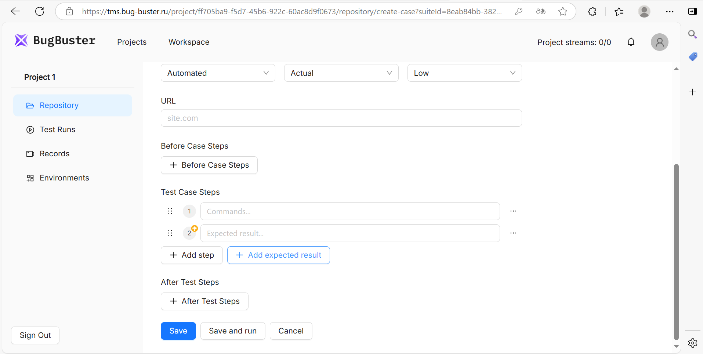
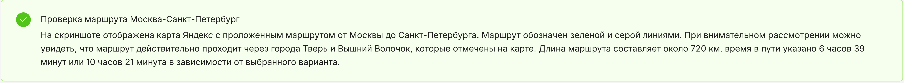
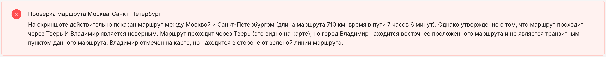

Проверки представляют собой описание ваших ожиданий от тестируемого интерфейса. Они добавляются через кнопку **\+ Add expected result**:

{width=1915px height=967px}

Система анализирует скриншот и проверяет, соответствует ли он вашему описанию.

:::note 

Проверки работают только с видимой частью скриншота. Например, проверка `Открылась страница по <URL>` не сработает, потому что на скриншот не попадет адресная строка браузера (система делает скрины через Browser API).

:::

Система всегда выдает бинарный результат. После проверки система добавляет объяснение своего решения -- почему проверка сработала или не сработала:

**Проверка пройдена**. Интерфейс соответствует описанию:

{width=5870px height=543px}

**Проверка не пройдена**. Элемент или состояние не обнаружены:

{width=5885px height=554px}

Cистема **отвечает на том языке, на котором написана проверка**. Это улучшает понимание логики работы модели и упрощает анализ результатов.

**Примеры проверок:**

`На странице отображается заголовок "Добро пожаловать"`

`Кнопка "Отправить" активна`

`В списке есть элемент "Корзина"`

`Отображается всплывающее окно с текстом "Данные сохранены"`

`На графике отображается 5 столбцов`

`В корзине отображаются 2 товара на сумму 1525 рублей`

Это не строгие шаблоны -- вы можете формулировать проверки так, как вам удобно. Со временем мы добавим примеры с ответами модели, чтобы показать, как система интерпретирует разные запросы.

### 

 