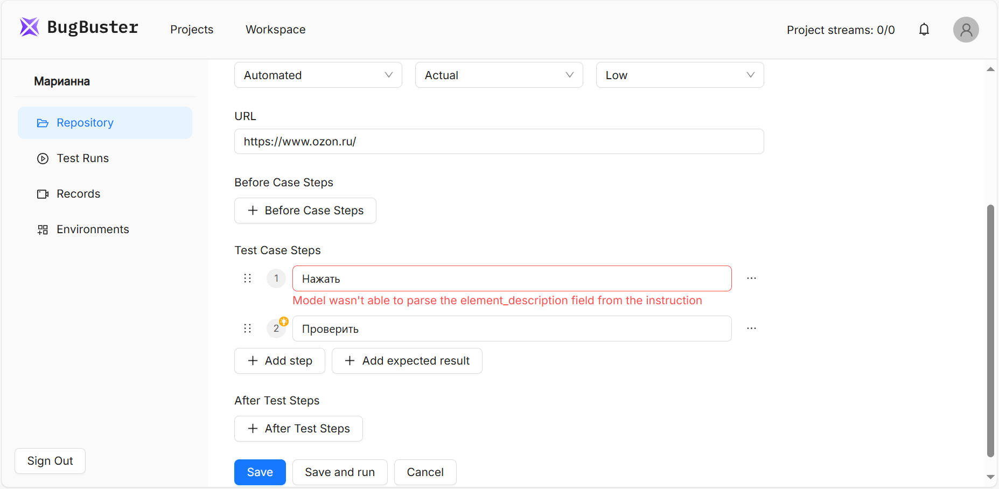
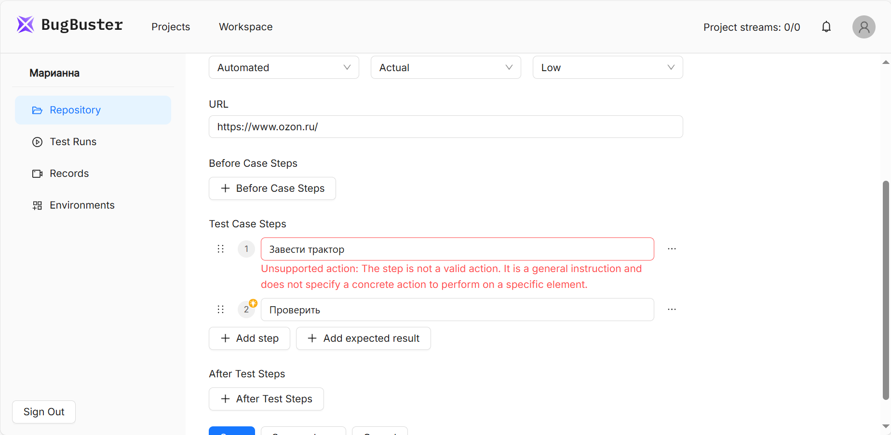

Платформа не только проверяет наличие четкого описания действия, но и анализирует контекст шага. При нажатии на кнопку **Save** или **Save and Run** автоматически запускается валидация шагов.

-  **Неоднозначные команды** (например, `"Нажать"`) вызывают ошибку. 

-  **Абстрактные проверки** (например, `"Проверить, что все хорошо"`) отклоняются.

#### **Примеры обработки ошибок**

Шаг: `"Нажать"` --> Ошибка:

{width=1855px height=908px}

Шаг: `"Завести трактор"` --> Ошибка:

{width=1848px height=905px}

#### **Как исправить невалидные шаги**

1. Добавьте целевой элемент (например, `"Нажать кнопку "Поиск""` вместо `"Нажать"`).

2. Замените абстрактные проверки (например, `"Проверить, что все хорошо"`) на конкретные (`"Текст "О компании" отображается"`).

3. Используйте [поддерживаемые действия](./podderzhivaemye-deystviya).

При сохранении тест-кейса система автоматически проверяет все шаги и предлагает либо исправить ошибки, либо перевести кейс в ручной режим (**manual**), если автоматизация невозможна.

:::tip 

Чтобы пройти тест-кейс [в ручном режиме](./zapusk-testov), при его создании или редактировании выберите **Manual** в поле **Execution type**.

:::

Для сложных случаев (например, работа с OCR-текстом или нестандартными клавишами) платформа предоставляет детальный **Action Plan** с указанием используемых переменных и элементов.