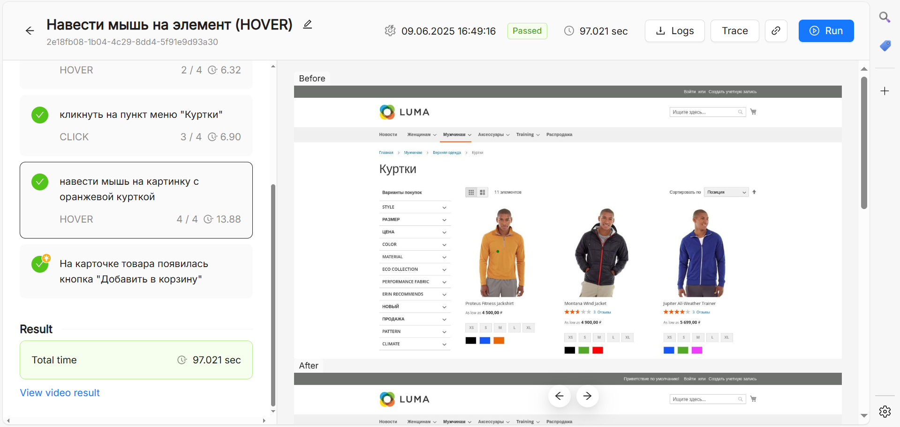
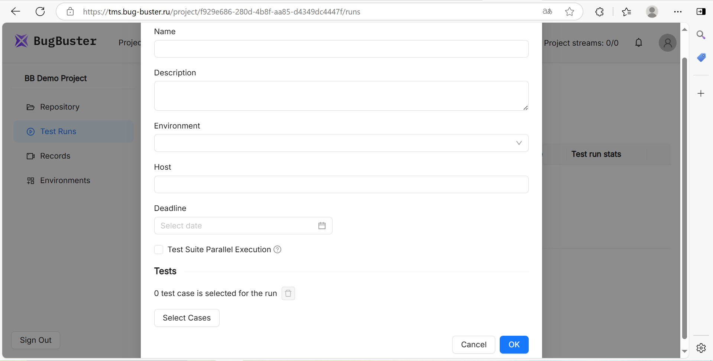

## **Одиночный запуск**

1. Нажмите **Run** в режиме просмотра или **Save and Run** в режиме редактирования кейса.

2. Вместе с результатом отобразятся:

   -  Скриншоты до/после каждого шага.

   -  Видео прохождения (опционально) в левой части экрана. Чтобы просмотреть его, перейдите по ссылке **View video result** в правой части экрана.

   -  Логи для дебага. Чтобы попасть в этот раздел, нажмите на кнопку **Logs** в верхней части экрана.

{width=1919px height=913px}

## **Массовый запуск (Test Runs)**

1. Создайте **Test Run** в одноименной вкладке.

2. Выберите:

   -  **Environment** (браузер, ОС, разрешение экрана). [Узнать больше о настройке окружения](./nastroyka-okruzheniya).

   -  **Параллельные потоки (стримы)**. Количество потоков зависит от тарифа. [Узнать больше о работе с потоками](./rabota-s-potokami).

3. Запустите и отслеживайте статус в реальном времени.

{width=1919px height=972px}

:::note 

При добавлении тест-кейса в **Test Run** его текущая версия фризится. Если после этого изменится сам тест-кейс (например, будут добавлены шаги или поправлены настройки), эти изменения не применятся к уже созданному **Test Run**. Чтобы запустить обновленную версию теста, необходимо создать новый **Test Run**.

:::

## **Manual (ручное прохождение)**

Вы можете пройти тест-кейс в ручном режиме. Для этого при его создании или редактировании выберите **Manual** в поле **Execution type**.

В репозитории тест-кейсы хранятся в дереве сьютов, на любом уровне которого можно создавать как автоматические, так и ручные кейсы.

Ручное прохождение тест-кейсов используется, когда:

-  Тест-кейс не может быть автоматизирован (например, требует визуальной проверки или сложных действий).

-  Необходимо проверить тест-кейс перед автоматизацией.

-  Автоматизированный запуск невозможен (например, из-за ограничений среды).

При ручном прохождении кейсов можно:

-  Проставлять статус каждого шага (**Passed/Failed**).

-  Добавлять комментарии и скриншоты.

-  Завершать весь кейс одним статусом (например, **Passed**), если не нужна детализация.

:::info 

Можно комбинировать автоматические и ручные проверки в одном проекте. **Automated** и **Manual** кейсы могут быть частью одного тест-рана (например, регресса). Результаты прохождения будут отображаться в отчете с пометкой типа выполнения.

:::